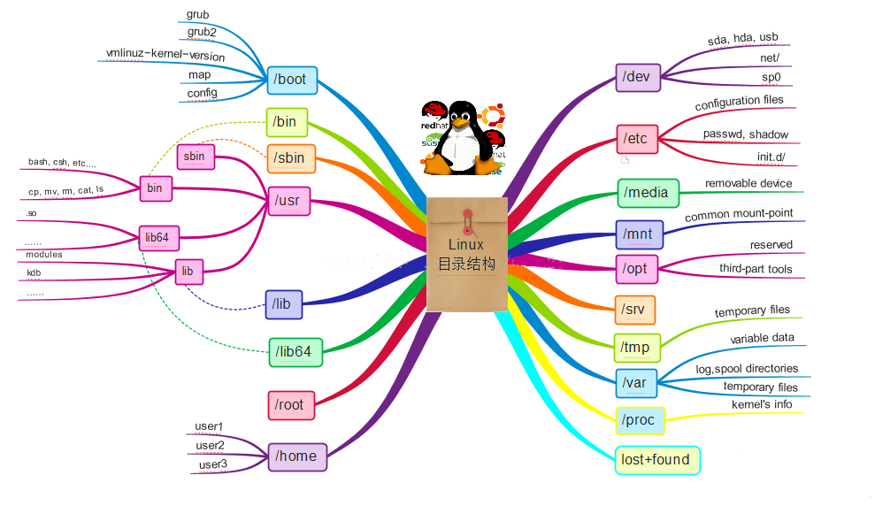

# 第1天

### <font color=red>文件目录操作</font>

**目录结构**



| 位置 | 目录用途 |
| --- | --- |
| /         | 系统的根目录 |
| /usr/bin  | 存放普通用户的二进制文件和实用程序 |
| /usr/sbin | 存放root用户使用的系统管理二进制文件 |
| /etc      | 各种服务配置文件 |
| /dev      | 设备文件目录 |
| /proc     | 虚拟文件系统，内存的映射 |
| /var      | 此目录包含动态配置数据，如邮件和网站以及系统日志 |
| /tmp      | 存储临时文件 |
| /usr      | 包含安装的软件程序和库 |
| /home     | 存放普通用户主目录 |
| /root     | root帐户的主目录  |
| /boot     | 引导程序配置目录 |
| /lib      | 库文件和内核模块 |
| /opt      | 安装第三方软件 |
| /mnt      | 临时文件系统挂载点 |
| /media    | 可移动存储设备挂载点，如 U盘，软盘，光盘等 |
| /srv      | 主动生产的数据、对外提供服务 |
| /run      | 包含动态的、非永久的应用运行时数据 |

**常用命令**

> 格式：要运行的**命令** 调整命令行为的**选项** 作为命令目标的**参数** 

| 操作 | 文件 | 目录 |
| --- | --- | --- |
| 增 | touch（创建空文件） | mkdir（创建空目录）<br/>mkdir -p（创建目录及上级目录） |
| 删 | rm -f（删除文件） | rmdir（删除空目录）<br/>rm -rf（删除非空目录） |
| 改 | cp（拷贝文件）<br/>mv（移动，重命名文件）<br/>vim（文本编辑器，i 编辑，esc&:wq 退出） | cd（切换目录）<br/>cp -r（拷贝目录）<br/>mv（移动，重命名目录） |
| 查 | cat（只读方式打开文件）<br/>head（查看文件开头 10 行，-n 自定义行号）<br/>tail（查看文件结尾 10 行，-n 自定义行号）<br/>more 分页显示 | pwd（输出当前路径）<br/>ls（列出目录内容，-l 详细信息，-a 所有文件） |

### <font color=red>其它常用命令</font>
| 命令     | 作用     |
| --- | --- |
| date     | 显示当前时间，--help 查看更多格式                            |
| echo     | 输出字符串                                                |
| file     | 查看文件类型                                                |
| which    | 通过 PATH 变量查找可执行程序路径                             |
| wc       | 统计，-l 行数，-w 单词数，-c 字节数                          |
| diff     | 比较两个文件内容不同之处                                     |
| wget     | 下载，-r 递归，-np 不包括父目录，--reject=html 不下载 html 文件 |
| free     | 查看内存情况                                              |
| history  | 查看历史命令                                              |
| poweroff | 关机                                                     |
| reboot   | 重启                                                     |

### <font color=red>中文 man 帮助</font>
**安装中文 man 软件包**
```
[root@localhost ~]# yum -y install man-pages-zh-CN
```
**使用 man -M 指定中文 man**
```
[root@localhost ~]# man -M /usr/share/man/zh_CN/ ls
```
**定义 alias 别名**
```
[root@localhost ~]# echo "alias cman='man -M /usr/share/man/zh_CN/'" >> /etc/bashrc
[root@localhost ~]# source /etc/bashrc
[root@localhost ~]# cman ls
```