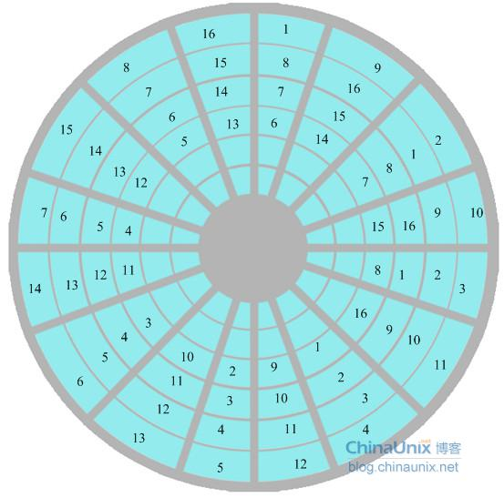
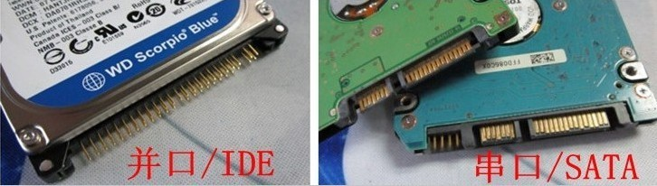
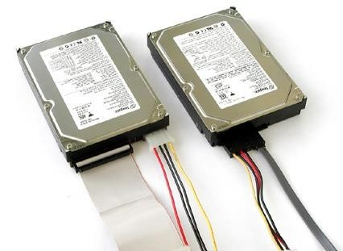
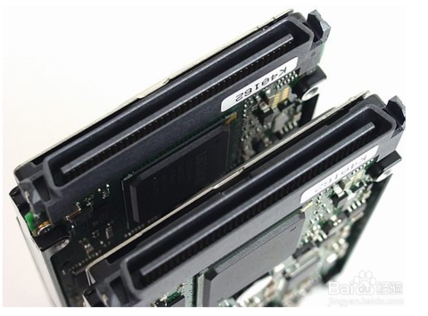
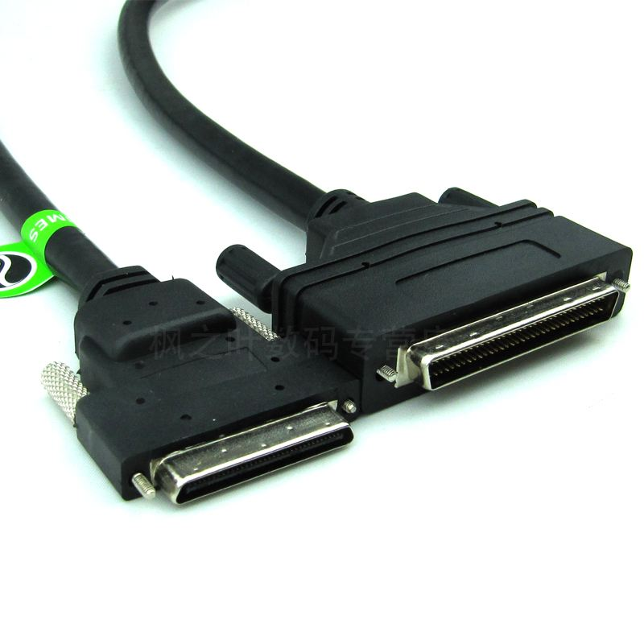
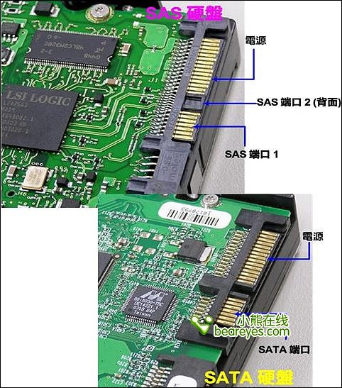
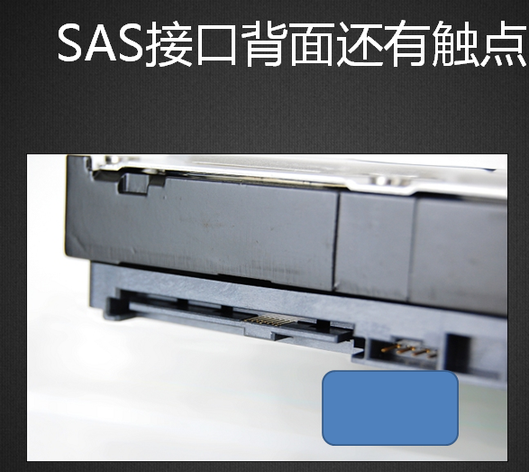
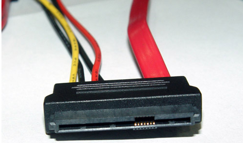
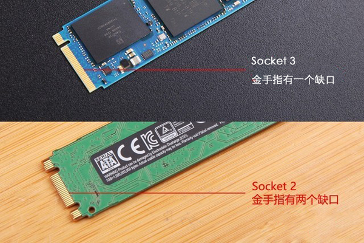

# 硬盘结构
  

### 盘片（platter）
硬盘一般有多个盘片，每个盘片可以有两个面(Side)，第 1 个盘片的正面称为 0 面，反面称为 1 面；第 2 个盘片的正面称为 2 面，反面称为 3 面...

### 磁头（head）
每个盘面对应一个磁头(head)用于读写数据。第一个盘面的正面的磁头称为 0 磁头，背面称为 1 磁头；第二个盘片正面的磁头称为 2 磁头，背面称为 3 磁头...因此，盘面数和磁头数是相等的。

### 磁道（track）
每个盘片的每个盘面被划分成多个狭窄的同心圆环，我们将这样的圆环称为磁道(Track)，每个盘面可以划分多个磁道。每个盘面的最外圈，离盘心最远的地方是 0 磁道，向盘心方向依次增长为 1 磁道，2 磁道，3 磁道...

### 扇区（sector）
把每个磁道划分成若干弧段，每段称为一个扇区(Sector),扇区是硬盘上存储的物理单位，扇区的编号是从 1 开始，而不是 0，物理扇区是连续的，但逻辑扇区不一定是连续的。    

##### 交叉因子
交叉因子是指低级格式化硬盘时必须设定扇区“间隔因子”值，间隔因子通俗的讲，是指低级格式化后，任意一个扇区和它下一个扇区相隔多少个物理扇区块。间隔因子为 1 时，扇区是连续的。间隔因子与硬盘转速、CPU速度、主板相匹配，否则影响硬盘性能。

### 柱面（cylinder）
不同面上相同编号的磁道组成了一个圆柱面，即所称的柱面(Cylinder)，磁盘的柱面数量与一个盘面上的磁道数量是相等的。    

# 硬盘接口

    

IDE（Integrated Drive Electronics）也叫 PATA（Parallel Advanced Technology Attachment）   

| 标准 | 速度    |
| ---- | ------- |
| PATA | 133MB/s |

SCSI（Small Computer System Interface）      

| 标准             | 速度    |
| ---------------- | ------- |
| Ultra Wide SCSI  | 40MB/s  |
| Ultra2 Wide SCSI | 80MB/s  |
| Ultra160 SCSI    | 160MB/s |
| Ultra320 SCSI    | 320MB/s |

SATA（Serial Advanced Technology Attachment）       

| 标准     | 速度    |
| -------- | ------- |
| SATA 1.0 | 150MB/s |
| SATA 2.0 | 300MB/s |
| SATA 3.0 | 600MB/s |

SAS（Serial Attached SCSI）    
传输的速率高达3Gb/s，以后会有6Gb/s乃至12Gb/s的高速接口出现。

M.2    

| 标准                   | 速度    |
| ---------------------- | ------- |
| Socket 2（B key-ngff） | 700MB/s |
| Socket 3（M key-nvme） | 4GB/s   |