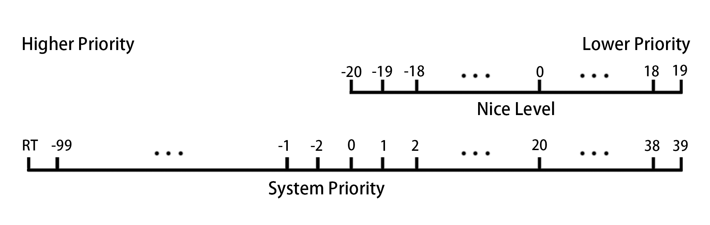

# 第2天

## <font color=red>进程优先级</font>


* Linux 实现了 140 个优先级范围，取值范围是从 -100~39，这个值越小，优先级越高
* 用户不可控 priority（PR）值，但可以定义 nice（NI）值
* nice 值的 -20~19，映射到实际的优先级范围是 0~39
* nice（NI）反应进程优先级状态的值，其取值范围是 -20 至 19，一共 40 个级别
* nice 值越小，表示进程”优先级”越高，而值越大优先级越低
* 普通用户只能提升使用正的 nice 级别，且只能提升 nice 级别，即只能降低优先级
* root 用户可以使用完整 nice 级别
* `nice -n NICE_LEVEL COMMAND` 命令用于新建进程时指定优先级
* `renice -n NICE_LEVEL PID ` 修改运行中进程的优先级。

## <font color=red>ACL 访问控制列表</font>
ACL 允许向文件分配细化权限，除标准的属主、属组和其他文件权限外，还可以给特定用户和特定的组，以及由 UID 或 GID 确定的用户和组授予权限。

* `ls -l` 列出内容权限部分后面为 `+` 代表此文件或目录有 acl 权限

* `getfacl` 用于查看 acl 详细信息

* `setfacl` 用于修改 acl 权限
* `getfacl -R directory > bakfile` 可以将输出结果保存为文件，`-p` 选项使用绝对路径<br/>`setfacl --restore=bakfile` 可以读取保存的文件进行恢复
* 最大有效权限 mask 限制通过 acl 赋予特定用户或组的权限

**setfacl 选项**

| 选项 | 作用 |
| --- | --- |
| -m | 设定 ACL 权限 |
| -x | 删除指定的 ACL 权限 |
| -b | 删除所有的 ACL 权限 |
| -d | 设定默认 ACL 权限，只对目录生效，目录中新建立的文件拥有此默认权限 |
| -k | 删除默认 ACL 权限|
| -R | 递归设定 ACL 权限， ACL 权限会对目录下的所有子文件生效 |

## <font color=red>SELinux</font>
* SELinux 是用于确定进程可以访问那些文件、目录和端口的一组安全规则。
* 每个文件、进程和端口都具有特别的安全标签，称为 SELinux 上下文，用来确定某个进程能否访问文件，目录和端口。
* SELinux 标签具有多种上下文：用户、角色、类型和敏感度，SELinux 目标策略根据类型上下文制定规则。

### 1. 文件目录上下文
#### 查看文间或目录当前的上下文
```
ls -Zd /PATH
```
#### 修改文件或目录当前的上下文
```
chcon -R -t TYPT /PATH
```
#### 查看 SELinux 制定的文件或目录上下文策略
```
semanage fcontext -l | grep TYPE
```
#### 制定新的文件或目录上下文策略
```
semanage fcontext -a -t TYPE '/PATH(/.*)?'
```
**删除上下文将 `-a` 改为 `-d`**

#### 根据 SELinux 策略修正文件或目录的上下文
```
restorecon -Rv /PATH
```

### 2.端口上下文
#### 查看 SELinux 制定的端口上下文
```
semanage port -l | grep TYPE
```
#### 添加端口到端口上下文
```
semanage port -a -t TYPE -p tcp/udp/icmp PORT
```
**删除端口将 `-a` 改为 `-d`**

### 3.布尔值
#### 查看 SELinux 制定的布尔值
```
semanage boolean -l | grep TYPE
或者
getsebool -a | grep TYPE
```
#### 修改 SElinux 的布尔值
```
semanage boolean --modify TYPE --on
或者
setsebool -P TYPE on
```
**`on` 为启用布尔值，`off` 为关闭布尔值**