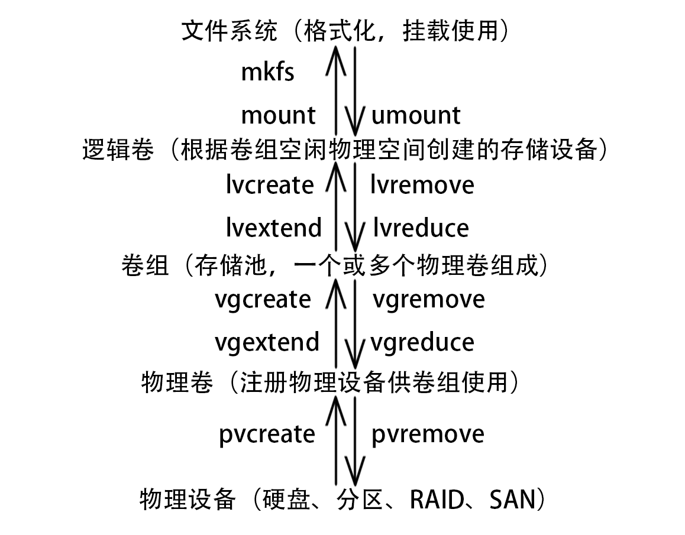

# 第3天

## <font color=red>分区管理</font>

### MBR 分区方案（BIOS 引导）
* 分区工具 `fdisk`
* 可以引导 32 位 或 64 位的系统
* 主引导记录包含 64 字节硬盘分区表，每个分区信息需要 16 字节
* 最多 4 个主分区，可以把一个主分区作为扩展分区，扩展分区可分为若干逻辑分区
* 主分区可以激活成为活动分区，用来引导系统
* 扩展分区不能直接使用，必须分为逻辑分区才可以使用
* 2T 以上硬盘不适用

### GPT 分区方案（UEFI 引导）
* 分区工具 `gdisk`
* 只能引导 64 位系统
* 最多 128 个分区，全是主分区
* 最大支持 18 EB，1EB = 1024PB，1PB =1024TB

### 格式化、挂载
* `lsblk` 查看块设备
* `blkid` 查看块设备 UUID（判断是否有文件系统）
* `mkfs.FileSystem` 格式化指定块设备，为其添加文件系统
* `mount` 用于临时挂载指定文件系统，`umount` 用于卸载文件系统
* `mount -a` 会根据 `/etc/fstab` 文件挂载所有文件系统
* `/etc/fstab` 文件添加对应文件系统可实现开机自动挂载
* 使用 autofs 可实现按需自动挂载

##### autofs
```
yum -y install autofs

vim /etc/auto.master
mnt（挂载目录上级目录） /etc/automount（映射文件）

vim /etc/automount
挂载目录 -fstype=文件系统类型 :/dev/sd...

systemctl restart autofs
systemctl enable autofs
```

### SWAP 交换空间
* 交换空间用于扩充系统 RAM，应将交换空间使用保持最低限度
* 交换空间的文件系统为 swap，格式化使用 `mkswap` 命令
* `swapon` 用于临时激活交换空间
* `swapon -a` 会根据 `/etc/fstab` 文件激活所有交换空间
* `swapon -s` 查看目前激活的交换空间
* `swapoff` 用于取消指定交换空间
* `/etc/fstab` 文件添加对应交换空间可实现开机自动激活，挂载点为 swap

## <font color=red>逻辑卷</font>



## <font color=red>故障排除</font>
#### 系统启动
1. BIOS/UEFI 硬件自检
2. 启动加载器（grub2）
3. kernel 和 initramfs 初始化
4. systemd 执行默认 target

#### 部分 target
| 目标 | 用途 |
| --- | --- |
| graphical.target | 图形化界面 |
| multi-user.target | 字符行界面 |
| rescue.target | 基本系统初始化完成 |
| emergency.target | initramfs 回转完成，系统只读方式挂载与 / 上 |

### 重置 root 密码
1. 开机启动菜单按e
2. linux16 结尾加 rd.break
3. Ctrl+x 执行
4. mount -o remount,rw /sysroot
5. chroot /sysroot
6. echo redhat | passwd --stdin root
7. touch /.autorelabel
8. exit
9. exit

### /etc/fstab 文件故障
1. 开机启动菜单按e
2. linux16 结尾加 systemd.unit=emergency.target
3. Ctrl+x 执行
4. 输入 root 密码
5. mount -o remount,rw /
6. vim /etc/fstab 修正错误
7. reboot

### /boot/grub2/grub.cfg 故障
1. 使用外部介质引导安装镜像
2. 选择 Troubleshooting
3. 选择 Rescue a CentOS system
4. 选择 1）Continue
5. chroot /mnt/sysimage
6. grub2-mkconfig > /boot/grub2/grub.cfg
7. exit
8. exit

### /boot 误删
1. 使用外部介质引导安装镜像
2. 选择 Troubleshooting
3. 选择 Rescue a CentOS system
4. 选择 1）Continue
5. chroot /mnt/sysimage
6. 重新安装 kernel 包（yum reinstall kernel 或 rpm --reinstall -vh /PATH_TO_CD/Packages/kernel*.rpm）
7. grub2-install /dev/sda
8. grub2-mkconfig > /boot/grub2/grub.cfg
9. exit
10. exit