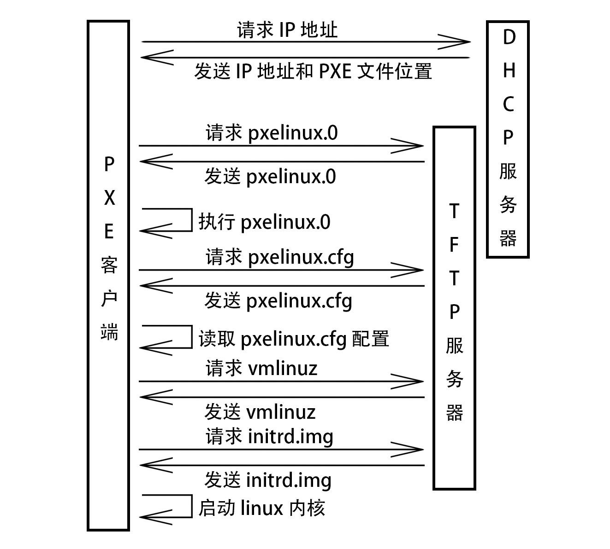

# 第5天
## <font color=red>PXE & Kickstart 批量安装</font>


1. PXE Client向DHCP发送请求 PXE Client从自己的PXE网卡启动，通过PXE BootROM(自启动芯片)会以UDP(简单用户数据报协议)发送一个广播请求，向本网络中的DHCP服务器索取IP。

2. DHCP服务器提供信息 DHCP服务器收到客户端的请求，验证是否来至合法的PXE Client的请求，验证通过它将给客户端一个“提供”响应，这个“提供”响应中包含了为客户端分配的IP地址、pxelinux启动程序(TFTP)位置，以及配置文件所在位置。

3. PXE客户端请求下载启动文件 客户端收到服务器的“回应”后，会回应一个帧，以请求传送启动所需文件。这些启动文件包括：pxelinux.0、pxelinux.cfg/default、vmlinuz、initrd.img等文件。

4. Boot Server响应客户端请求并传送文件 当服务器收到客户端的请求后，他们之间之后将有更多的信息在客户端与服务器之间作应答, 用以决定启动参数。BootROM由TFTP通讯协议从Boot Server下载启动安装程序所必须的文件(pxelinux.0、pxelinux.cfg/default)。default文件下载完成后，会根据该文件中定义的引导顺序，启动Linux安装程序的引导内核。

5. 请求下载自动应答文件 客户端通过pxelinux.cfg/default文件成功的引导Linux安装内核后，安装程序首先必须确定你通过什么安装介质来安装linux，如果是通过网络安装(NFS, FTP, HTTP)，则会在这个时候初始化网络，并定位安装源位置。接着会读取default文件中指定的自动应答文件ks.cfg所在位置，根据该位置请求下载该文件。

   > 这里有个问题，在第2步和第5步初始化2次网络了，这是由于PXE获取的是安装用的内核以及安装程序等，而安装程序要获取的是安装系统所需的二进制包以及配置文件。因此PXE模块和安装程序是相对独立的，PXE的网络配置并不能传递给安装程序，从而进行两次获取IP地址过程，但IP地址在DHCP的租期内是一样的。

6. 客户端安装操作系统 将ks.cfg文件下载回来后，通过该文件找到OS Server，并按照该文件的配置请求下载安装过程需要的软件包。 OS Server和客户端建立连接后，将开始传输软件包，客户端将开始安装操作系统。安装完成后，将提示重新引导计算机。

#### 安装软件包
```
[root@server ~]# yum -y install tftp-server dhcp syslinux httpd
```
#### 配置 dhcp
```
[root@server ~]# vim /etc/dhcp/dhcpd.conf
subnet 172.25.254.0 netmask 255.255.255.0 {
  range 172.25.254.1 172.25.254.250;
  option routers 172.25.254.254;
  default-lease-time 600;
  max-lease-time 7200;
  filename "/pxelinux.0";
}
[root@server ~]# systemctl restart dhcpd
[root@server ~]# systemctl enable dhcpd
```
#### 关闭防火墙和 SELinux
```
[root@server ~]# systemctl stop firewalld
[root@server ~]# systemctl disable firewalld
[root@server ~]# setenforce 0
[root@server ~]# vim /etc/selinux/config
SELINUX=disabled
```
#### 配置 tftp
```
[root@server ~]# vim /etc/xinetd.d/tftp
service tftp
{
        socket_type             = dgram
        protocol                = udp
        wait                    = yes
        user                    = root
        server                  = /usr/sbin/in.tftpd
        server_args             = -s /var/lib/tftpboot
        disable                 = no
        per_source              = 11
        cps                     = 100 2
        flags                   = IPv4
}
[root@server ~]# systemctl restart tftp
[root@server ~]# systemctl enable tftp
```
#### 配置 pxe 引导文件
```
[root@server ~]# cp /usr/share/syslinux/pxelinux.0 /var/lib/tftpboot/
[root@server ~]# mkdir /var/www/html/cdrom
[root@server ~]# mount /dev/sr0 /var/www/html/cdrom
[root@server ~]# cp /var/www/html/cdrom/isolinux/{vmlinuz,initrd.img} /var/lib/tftpboot/
[root@server ~]# mkdir /var/lib/tftpboot/pxelinux.cfg
[root@server ~]# cp /var/www/html/cdrom/isolinux/isolinux.cfg /var/lib/tftpboot/pxelinux.cfg/default
[root@server ~]# vim /var/lib/tftpboot/pxelinux.cfg/default
default linux
... ...
label linux
  menu label ^Install CentOS 7
  kernel vmlinuz
  append initrd=initrd.img inst.stage2=http://172.25.254.254/cdrom ks=http://172.25.254.254/ks.cfg quiet
... ...
```
#### 准备 Kickstart 无人值守文件
```
[root@server ~]# cp anaconda-ks.cfg /var/www/html/ks.cfg
#version=DEVEL
# System authorization information
auth --enableshadow --passalgo=sha512
# Use CDROM installation media
url --url=http://172.25.254.254/cdrom
# Use graphical install
graphical
# Run the Setup Agent on first boot
firstboot --enable
ignoredisk --only-use=sda
# Keyboard layouts
keyboard --vckeymap=us --xlayouts='us'
# System language
lang en_US.UTF-8

# Network information
network  --bootproto=dhcp --device=ens33 --onboot=off --ipv6=auto --no-activate
network  --hostname=localhost.localdomain

# Root password
rootpw --iscrypted $6$BJfADb7EusYxHOyu$aKf2OgGT3qSOKdwgvUd8y3ZI4T4ZWe40DZ4ZfN4PEA8ceFuuauBGVUsqM12RYu36w8SwdKzjbXz2kt.NdxSmn.
# System services
services --disabled="chronyd"
# System timezone
timezone Asia/Shanghai --isUtc --nontp
# System bootloader configuration
bootloader --append=" crashkernel=auto" --location=mbr --boot-drive=sda
autopart --type=lvm
# Partition clearing information
clearpart --none --initlabel

%packages
@^minimal
@core
kexec-tools

%end

%addon com_redhat_kdump --enable --reserve-mb='auto'

%end

%anaconda
pwpolicy root --minlen=6 --minquality=1 --notstrict --nochanges --notempty
pwpolicy user --minlen=6 --minquality=1 --notstrict --nochanges --emptyok
pwpolicy luks --minlen=6 --minquality=1 --notstrict --nochanges --notempty
%end
```
#### 启动 apache，测试能否访问安装源和 ks 文件
```
[root@server ~]# systemctl restart httpd
[root@server ~]# systemctl enable httpd
浏览器访问 172.25.254.254/cdrom 和 172.25.254.254/ks.cfg
```

#### 裸机网络引导安装系统